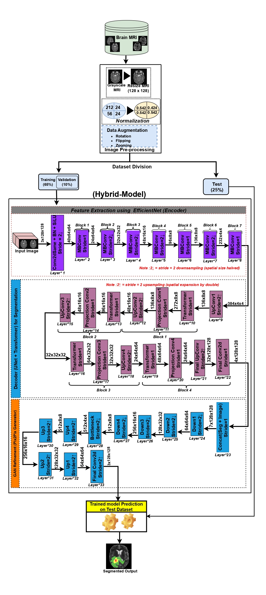

# Brain Tumor Segmentation using Hybrid Deep Learning Model

##  Overview

Brain tumor segmentation is a critical task in medical image analysis, playing a pivotal role in diagnosis, treatment planning, and monitoring. This repository presents a **hybrid deep learning framework** that combines the strengths of multiple state-of-the-art architectures to enhance segmentation performance on multi-modal MRI data.

The model integrates:

- **EfficientNetV2-S** for efficient and robust multi-scale feature extraction
- **U-Net** for spatial localization through encoder-decoder architecture with skip connections
- **Transformer module** to capture global contextual relationships
- **Pix2Pix GAN** for post-processing and adversarial refinement of segmentation masks

This end-to-end framework is designed to address key challenges such as heterogeneous tumor morphology, small lesion detection, and poor boundary localization in brain tumor MRI scans.

---

##  Architecture

 <!-- Replace with actual path if you upload image -->

The pipeline includes:

1. **Preprocessing** (Skull-stripping, normalization, resizing to 128×128)
2. **EfficientNetV2-S** as encoder
3. **Transformer at U-Net bottleneck**
4. **U-Net decoder**
5. **Pix2Pix GAN** for refined output

---

##  Datasets Used

- **BraTS 2020** (369 training + 125 validation cases)
- **Figshare D1–D4** (3064 slices across multiple tumor types)

MRI modalities used: FLAIR, T1c, T2

---

##  Preprocessing

- Resizing all images to **128×128**
- Normalization to **[0,1]**
- Data augmentation: random rotation, flipping, and zooming
- Slices extracted as 2D multi-modal inputs (3-channel)

---

##  Model Components

| Component         | Purpose                                      |
|------------------|----------------------------------------------|
| EfficientNetV2-S | Lightweight, high-quality feature extraction |
| U-Net            | Precise localization with skip connections   |
| Transformer      | Capture long-range dependencies              |
| Pix2Pix GAN      | Mask refinement & boundary smoothing         |

---

##  Evaluation Metrics

- **Dice Similarity Coefficient (DSC)**: ≥ 0.94 on Figshare D2
- **IoU (Jaccard Index)**: ≥ 0.85
- **Hausdorff Distance**: Reduced by ~15% vs. baselines

---

## Results

| Model Variant                       | Dataset       | Dice Score |
|------------------------------------|---------------|------------|
| U-Net + EfficientNetV2 + Transformer + GAN | Figshare D2 | **0.9671**   |
| U-Net + EfficientNetV2 + Transformer       | BraTS 2020   | 0.8954     |
| With GAN refinement                | BraTS 2020   | **0.9416**   |

---

## Research Paper

 

##  How to Run

1. Clone the repo:
   ```bash
   git clone https://github.com/yourusername/brain-tumor-hybrid-segmentation.git
   cd brain-tumor-hybrid-segmentation
2. Install dependencies:
    ```bash
   pip install -r requirements.txt
3. Prepare data:

   Download the BraTS and Figshare datasets

    Preprocess the MRI slices as per instructions in preprocessing
4. Train the model
5. Run GAN post-processing

## References
1. Siddique et al., "U-Net and Its Variants for Medical Image Segmentation", IEEE Access, 2021

2. Zhou et al., "MR-Based Brain Tumor Segmentation with Missing Modalities", 2023

3. Cheng J., Brain Tumor Dataset on Figshare

4. BraTS 2020 Dataset on Kaggle

5. Ali et al., "GANs in Medical Image Processing", Archives of Computational Methods, 2024

## Authors
Siddenthi Uday Kumar – siddenthiuday@gmail.com

Kushal Bansal, Aditya Khairnar, Jatavath Siddhartha Nayak, Sushmitha Pothuraju
(IIIT Allahabad)

